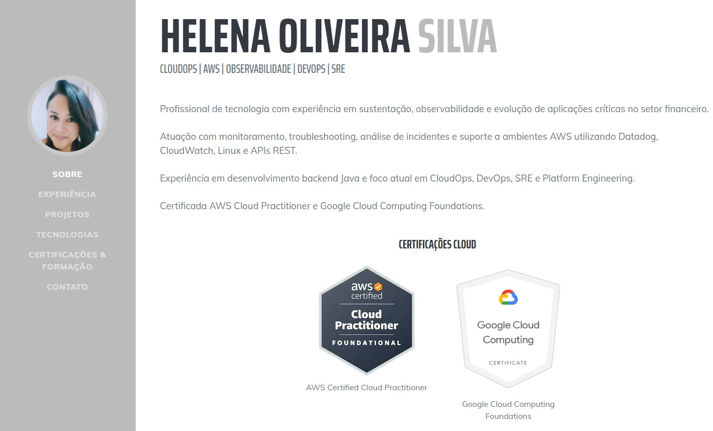

# Helena Oliveira Silva | CloudOps Portfolio

Portfólio profissional desenvolvido para apresentar minha trajetória, experiência, certificações e projetos práticos nas áreas de Cloud Computing, CloudOps, DevOps, Observabilidade e SRE.

## 🌐 Portfólio Online

Acesse o portfólio:

🔗 https://helena-hos.github.io

---

## 👩‍💻 Sobre

Profissional de tecnologia com experiência em sustentação, observabilidade e evolução de aplicações críticas no setor financeiro.

Atuação com monitoramento, análise de incidentes, troubleshooting e ambientes AWS utilizando Datadog, CloudWatch, Linux e APIs REST.

Experiência em desenvolvimento backend Java e foco atual em CloudOps, DevOps, SRE e Platform Engineering.

---

## 🚀 Principais Tecnologias

- AWS
- Linux
- Docker
- Terraform
- Kubernetes
- Git & GitHub
- Bash Script
- Java
- Spring Boot
- Datadog
- CloudWatch
- APIs REST
- CI/CD

---

## 📂 Projetos em Destaque

### AWS IAM Automation

Projeto de automação para provisionamento de grupos e usuários IAM utilizando Bash Script e AWS CLI.

**Tecnologias:** AWS IAM, EC2, IAM Role, STS, Bash Script, Linux e GitHub.

🔗 Repositório:  
https://github.com/HELENA-HOS/aws-iam-automation

---

### DevOps Lab Project

Projeto prático voltado para estudos de Cloud, Containers, Infraestrutura como Código, Automação e CI/CD.

**Tecnologias:** Docker, Kubernetes, Terraform, GitHub Actions, FastAPI e Linux.

🔗 Repositório:  
https://github.com/HELENA-HOS/devops-lab-project

---

## 🏅 Certificações

- AWS Certified Cloud Practitioner
- Google Cloud Computing Foundations Certificate
- Linux Essentials
- Linux Fundamentals
- AWS Academy Cloud Foundations
- Google Cloud Fundamentals

---

## 🎓 Formação Acadêmica

### Pós-graduação em Análise e Desenvolvimento de Sistemas
Conclusão: 01/2026

### Bacharelado em Administração de Empresas
Conclusão: 12/2009

---

## 📫 Contato

**LinkedIn**  
https://www.linkedin.com/in/helena-oliveira-silva/

**GitHub**  
https://github.com/HELENA-HOS

**E-mail**  
helena_oliveirasilva@yahoo.com.br

---

## 📄 Sobre este projeto

Este repositório contém o código-fonte do meu portfólio profissional, publicado por meio do GitHub Pages.

O objetivo é centralizar informações sobre minha trajetória profissional, projetos, certificações e estudos voltados para Cloud Computing, CloudOps, DevOps e SRE.
